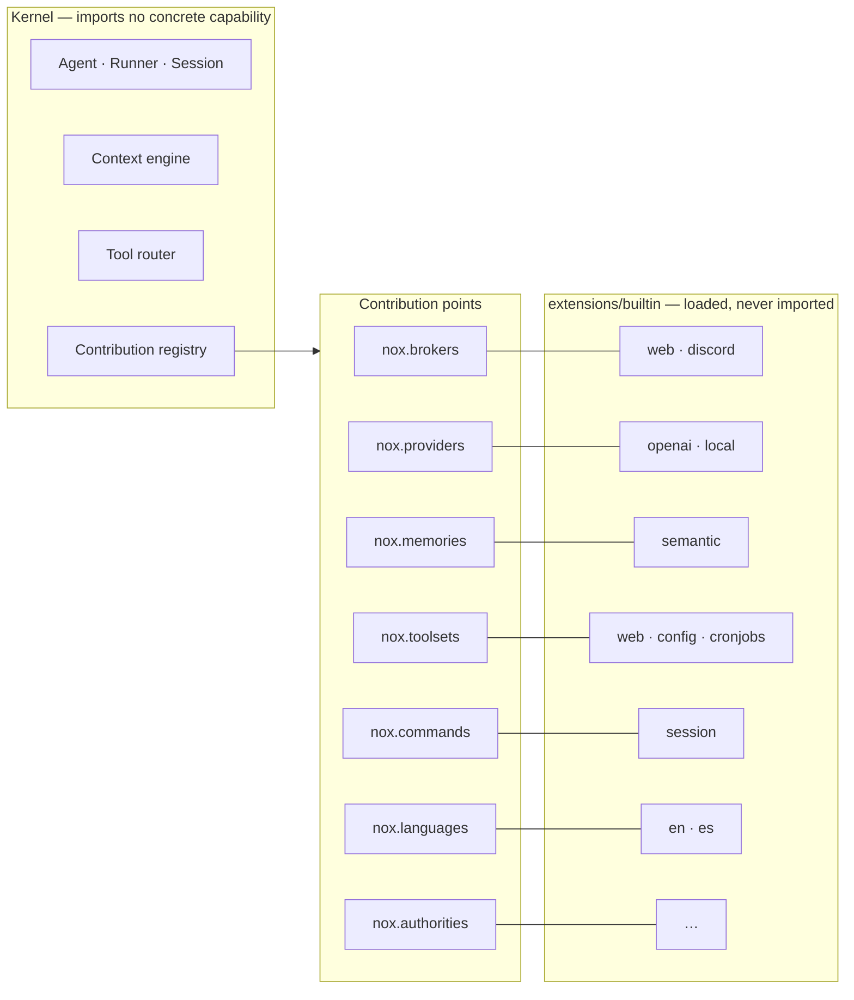
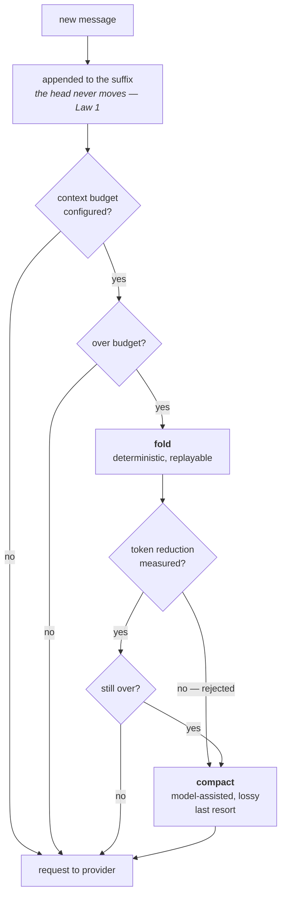

<div align="center">


**A containerized, multi-agent runtime built so that a long-running session stays cheap.**

[](https://bun.sh)
[](https://www.typescriptlang.org/)
[](LICENSE)


[Quickstart](#quickstart) · [The three laws](#the-three-laws) · [Documentation](#documentation) · [Architecture](docs/architecture.md)

</div>

---

## What Nox is

Most agent runtimes get more expensive the longer you talk to them. Every turn
re-sends a slightly different prefix, so the provider's cache never hits; every
tool result stays in the window until something summarizes the whole
conversation away; and every capability that gets added is one more `import` in
a file that already knows too much.

Nox is built the other way around. The beginning of every request is
deterministic and append-stable, so a provider may reuse it. Mechanical traffic
is collapsed by rule before anything is summarized. Work that a function can do
is never asked of a model. And no concrete capability — no provider, no memory,
no transport — is imported by the kernel: each one arrives as a *contribution*
registered against a typed slot.



---

## The three laws

These are the whole point. A feature that violates one of them is not a Nox
feature, regardless of how useful it is.

### Law 1 — The request head is stable infrastructure

The beginning of every logical request is system instructions, tool schemas and
settled history. Nox keeps that sequence deterministic and append-stable so a
provider may reuse it. Whether it is cached, where the boundary falls and what a
hit is worth belong entirely to the provider.

- Tool schemas are presented in deterministic, name-sorted order. Map iteration
  order is never trusted, and provider adapters preserve that order when they
  serialize.
- Messages are immutable snapshots once inserted. Nothing mutates a message in
  place after the fact.
- **New information enters at the suffix.** Anything that varies during a session
  — recalled memory, tool results, fresh facts — is appended at the end of the
  working set. It never edits the head.
- **The fixed head may only contain what is stable for the whole session.** A
  blueprint's persona and its tool schemas qualify. A recalled fact does not.
- **Exactly two operations may replace active history: `fold` and `compact`.**
  Not a recall, not a tool result, not a broker, not an extension. Everything
  else appends.
- **Prompt caching is provider behavior, not kernel state.** Nox does not declare
  cache boundaries or estimate invalidation. An adapter reports actual cache-read
  usage when its API exposes it; otherwise Nox makes no claim.

### Law 2 — Fold first. Compaction is the last resort.

Folding is deterministic and reversible-by-replay: mechanical traffic is
collapsed by rule, and the original is still in the transcript. Compaction is
model-assisted and **lossy** — what you do when folding has already run and the
working set is still over budget.



- A settled tool loop tries deterministic folding before a later request may
  compact. Folding never runs mid-tool-loop just because token pressure rose.
- **No budget, no compaction.** Without a configured context window there is no
  pressure signal and `compact()` is a no-op. Summarizing lossily on a guess is
  not a smaller version of compaction; it is the thing compaction is the last
  resort *for*, performed for no reason.
- A fold must **measurably** reduce the active context, in tokens, before it is
  applied. A fold that merely breaks even is rejected.
- Both are transcript events, not destructive mutations. "Deleted to save space"
  is never the mechanism.

### Law 3 — If it can be deterministic, it must not be a prompt

Asking a model to do what a function can do costs tokens, costs latency, and
produces a worse answer with a confidence interval attached.

- **Prefer tools over skills.** A capability the model *calls* beats a capability
  the model must *follow*.
- Parsing, formatting, sorting, filtering, arithmetic, validation, routing,
  lookups and state transitions are code. They do not get prompt paragraphs.
- The model is asked for judgment, language and synthesis. Not for work.

### Supporting rules

- **History is not context.** The transcript is permanent and complete; the
  working set is bounded and provider-ready. They are different objects.
- **Retrieval is bounded.** A recall must never quietly undo the space that
  folding and compaction reclaimed.
- **Replay is the source of truth.** A persisted transcript must reconstruct the
  identical active history.
- **The runtime owns memory policy, not the model.**
- **Pressure is measured before the provider rejects the request**, not after.

---

## Quickstart

```bash
bun install
bun run check        # typecheck + lint + format + tests
```

```bash
export CONFIG_DIR=./.nox/config          # optional, see src/config/env.ts
export DATA_DIR=./.nox/data              # database and local secret key
export EXTENSIONS_DIR=./.nox/extensions  # defaults to DATA_DIR/extensions
export UI_DIR=./src/ui/dist              # output of `bun run build:ui`

bun run build:ui
bun run start
```

The first run writes `app.json` into `CONFIG_DIR` with defaults and migrates a
SQLite database into `DATA_DIR`. Type to talk; `/exit` or Ctrl-C ends the
session. Replies stream to stdout and every log line goes to stderr, so
`bun run start 2>/dev/null` gives you the conversation alone.

See **[docs/configuration.md](docs/configuration.md)** for every environment
variable, the `app.json` sections, and how secrets are referenced.

---

## What exists today

Nox is pre-1.0. This table is kept honest — if something is listed here, it is
built and covered by tests.

| Area | State |
|---|---|
| Context engine — transcript, fold, compact, token accounting | Built and tested |
| Agent, session, runner, event log, session store | Built and tested |
| Contribution contract, extension loader, `NoxApplication` | Built and tested |
| Tools, tool sets, and the `tool_search`/`tool_call` router | Built and tested |
| Config (Zod-validated sections), SQLite via Drizzle, encrypted secret store | Built and tested |
| Provider contract — `BaseProvider`, `ChatProvider`, streaming, retries | Built and tested |
| Providers: OpenAI Chat Completions, and a local adapter | Built and tested |
| Semantic memory — vector store, extraction, consolidation, contradictions | Built and tested |
| Brokers: the `web` HTTP surface and a Discord transport | Built and tested |
| Tool sets: web search/extraction, configuration administration, cron jobs | Built and tested |
| Artifact pipeline — streamed ingestion, SHA-256 dedup, rendition cache, Sharp | Built and tested |
| Scheduler — durable cron jobs in fresh sessions, with delivery targets | Built and tested |
| Web UI — Vue 3 + Pinia: chat, sessions, settings, audit | Built and tested |

**Not yet:** extension isolation and a declared permission model — installing an
extension today grants it the whole process — and with it, installing
third-party packages from outside the image. Artifacts have storage quotas but
no retention or deletion lifecycle, so a full store refuses new blobs rather
than evicting old ones. Each is described where it belongs in the docs.

---

## Documentation

| Document | What is in it |
|---|---|
| [docs/architecture.md](docs/architecture.md) | The kernel, contribution points, services, and the composition root |
| [docs/context-engine.md](docs/context-engine.md) | Transcript vs. working set, fold, compact, token accounting |
| [docs/configuration.md](docs/configuration.md) | Environment, `app.json`, live reconciliation, secrets |
| [docs/ui.md](docs/ui.md) | The web UI: stack, state ownership, theming, HTTP contract |
| [docs/extensions/](docs/extensions/README.md) | Writing an extension, the manifest, the public API |
| [· memory.md](docs/extensions/memory.md) | The semantic memory builtin |
| [· providers.md](docs/extensions/providers.md) | Provider adapters and model modalities |
| [· brokers.md](docs/extensions/brokers.md) | The web and Discord transports, broker capabilities |
| [· configuration.md](docs/extensions/configuration.md) | The `config` tool set: agent-managed desired state |
| [· jobs.md](docs/extensions/jobs.md) | The `cronjobs` tool set: durable scheduled automation |
| [· files.md](docs/extensions/files.md) | Artifacts: uploads, blobs, renditions, delivery |
| [· models.md](docs/extensions/models.md) | Models for internal tasks |

---

## Repository layout

```text
src/agent/           agent, session, runner, and the context engine
src/api/             the authenticated HTTP surface
src/artifact/        the artifact pipeline: blobs, renditions, delivery
src/auth/            account registration and access tokens
src/config/          Zod-validated configuration sections and the loader
src/database/        Drizzle schema, migrations, session store, history index
src/extensions/      the contribution registry, manifest parser and loader
src/extensions/builtin/   builtins grouped by contribution point, then package
src/gateway/         the message gateway brokers speak to
src/i18n/            locale resolution and message catalogs
src/provider/        the provider contract and streaming
src/runtime/         process lifecycle and reconciliation
src/scheduler/       durable cron jobs
src/tool/            tools, tool sets, the router
src/ui/              the Vue 3 web UI
src/application.ts   the composition root

packages/extension-api/   the public, versioned extension contract
examples/extensions/      an independently compiled consumer
```

---

## License

MIT — see [LICENSE](LICENSE). Third-party notices are collected in
[THIRD-PARTY-NOTICES.md](THIRD-PARTY-NOTICES.md).
