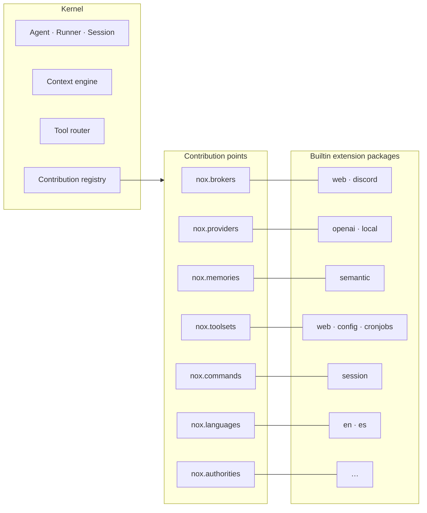
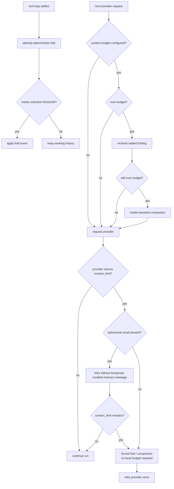
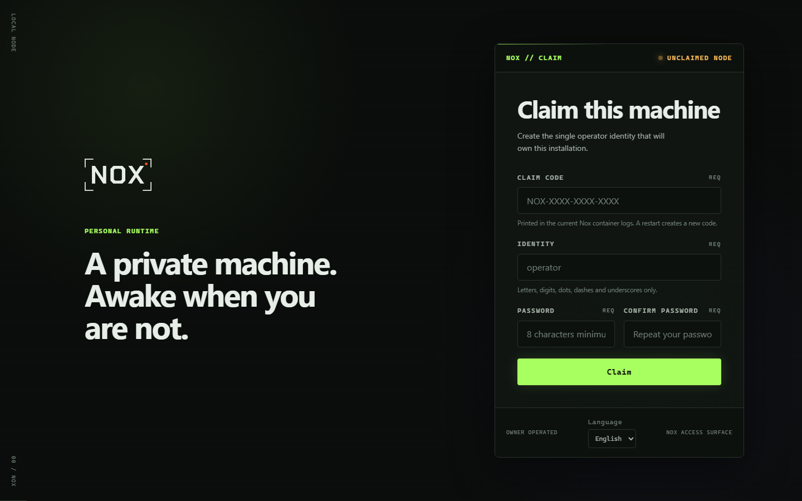
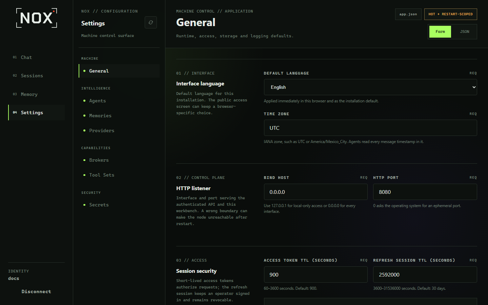

<div align="center">


**An early-stage, containerized runtime for multi-agent sessions and extension-based capabilities.**

[](https://bun.sh)
[](https://www.typescriptlang.org/)
[](LICENSE)


[Overview](#overview) · [Design goals](#design-goals) · [Screenshots](#screenshots) · [Quickstart](#quickstart) · [Documentation](#documentation)

</div>

---

## Overview

Nox is a pre-1.0 agent runtime with sessions, tools, providers, memory,
transports, scheduled jobs, artifacts, and a web interface. Its current design
focuses on two areas:

- keeping the reusable part of a model request stable where the runtime can do
  so, while reducing older tool traffic before using lossy compaction;
- loading concrete capabilities through a public extension contract rather than
  wiring each builtin directly into the kernel.

A stable request prefix may help a provider reuse cached input, but the result
depends on the provider, model, configuration, and workload. Nox does not yet
publish a benchmark for token savings, latency, or cost, so this README does not
claim a measured improvement.

The extension boundary is visible in the current source and in
[`src/boundaries.test.ts`](src/boundaries.test.ts): builtin packages register
against typed contribution points and are discovered at startup. Extensions
still execute in the Nox process; this is an API boundary, not a security
sandbox. See [Known limitations](#known-limitations).



---

## Design goals

These are development goals, not claims that every edge case has been solved.
The corresponding current behavior is documented in
[docs/context-engine.md](docs/context-engine.md) and covered by the tests under
[`src/agent/context/`](src/agent/context/).

### 1. Favor stable request prefixes

Nox tries to keep stable session instructions and tool schemas at the beginning
of a request, while appending information that changes during a session.

Current implementation details include:

- tool schemas are sorted by name before they are exposed to a provider;
- transcript messages are stored as immutable snapshots;
- recalled memory, tool results, and new messages enter the working history as
  appended information;
- fold and compaction events record replacements in the transcript;
- prompt caching remains provider behavior. Nox records cache-read usage only
  when an adapter reports it.

### 2. Prefer reversible reduction before lossy compaction

Folding replaces settled tool traffic with a smaller, deterministic record while
retaining the original events in the transcript. The runner attempts it whenever
a tool loop settles, independently of any context budget. A candidate is applied
only when it meets the configured reduction threshold.

Compaction uses a model to summarize part of the working set and is therefore
lossy. Its automatic path is separate: before a provider request, a configured
budget can report pressure; the context rechecks folding and compacts only if
pressure remains.



**No configured budget does not rule out compaction in every case.** It disables
the automatic pressure-triggered path. If the provider returns `context_limit`,
the runner first omits the temporary message containing memories retrieved for
that request, when present, and retries. This does not delete anything from the
memory backend or transcript. If the provider still refuses the request, Nox
calls `context.compact({ force: true })`. That forced pass rechecks folding and
may run lossy compaction without a configured `contextWindow`; after a
successful reduction, the provider request is retried once.

A person can also request a forced compaction explicitly through the session
command.

### 3. Use code for deterministic operations

Where a task can be represented reliably as parsing, validation, sorting,
routing, arithmetic, or a state transition, the project prefers ordinary code
or a callable tool. Prompts are reserved for work that needs model judgment,
language, or synthesis. This is a design preference rather than a prohibition;
trade-offs can change as the project is tested in real workloads.

### Related considerations

- Transcript history and provider-ready context are separate objects.
- Retrieval is given a budget so it does not immediately refill reduced context.
- Persisted fold and compaction events are used to rebuild active history.
- Context pressure is estimated before a provider request; reported provider
  usage can recalibrate later estimates.

---

## Screenshots

These screenshots were captured from a clean local installation of the current
development build. The interface is still evolving.

### First-run claim screen



### General settings



---

## Quickstart

```bash
bun install
bun run check        # typecheck + lint + format check + tests
```

```bash
export CONFIG_DIR=./.nox/config          # optional, see src/config/env.ts
export DATA_DIR=./.nox/data              # database and local secret key
export EXTENSIONS_DIR=./.nox/extensions  # defaults to DATA_DIR/extensions
export UI_DIR=./src/ui/dist              # output of `bun run build:ui`

bun run build:ui
bun run start
```

The first run writes `app.json` into `CONFIG_DIR` with defaults and applies the
SQLite migrations in `DATA_DIR`. The terminal surface accepts messages;
`/exit` or Ctrl-C ends the session. Replies use stdout and logs use stderr.

See [docs/configuration.md](docs/configuration.md) for the environment variables,
configuration sections, and secret references.

---

## Current implementation

Nox is pre-1.0 and its surface may change. The table below describes code in the
current tree and links representative automated coverage. A passing test suite
is useful evidence of implemented behavior, but it is not a performance,
reliability, or security certification.

| Area | Current state | Representative evidence |
|---|---|---|
| Context transcript, folding, compaction, and token estimates | Implemented | [`src/agent/context/`](src/agent/context/), [`context.test.ts`](src/agent/context/context.test.ts), [`transcript.test.ts`](src/agent/context/transcript.test.ts) |
| Agents, sessions, runner, and persisted session history | Implemented | [`src/agent/`](src/agent/), [`src/application.test.ts`](src/application.test.ts), [`src/bootstrap.test.ts`](src/bootstrap.test.ts) |
| Extension discovery, contribution points, scoped host services, host-package checks, and declaration disclosure | Implemented | [`src/extensions/`](src/extensions/), [`loader.test.ts`](src/extensions/loader.test.ts), [`service.test.ts`](src/extensions/service.test.ts), [`hostPackages.test.ts`](src/extensions/hostPackages.test.ts) |
| Configuration, SQLite, authentication, and secret references | Implemented | [`src/config/`](src/config/), [`src/api/auth/`](src/api/auth/), [`src/config/config.test.ts`](src/config/config.test.ts), [`src/api/auth/auth.test.ts`](src/api/auth/auth.test.ts) |
| OpenAI-compatible and local providers, semantic memory, and tool routing | Implemented | [`src/extensions/builtin/providers/`](src/extensions/builtin/providers/), [`src/extensions/builtin/memories/semantic/`](src/extensions/builtin/memories/semantic/), [`src/tool/router.test.ts`](src/tool/router.test.ts) |
| Web and Discord brokers, artifacts, and scheduled runs | Implemented | [`src/extensions/builtin/brokers/`](src/extensions/builtin/brokers/), [`src/artifact/`](src/artifact/), [`src/scheduler/scheduledRun.test.ts`](src/scheduler/scheduledRun.test.ts) |
| Vue web UI for access, chat, sessions, memory, settings, and audit data | Implemented; browser E2E coverage is still pending | [`src/ui/`](src/ui/), [`src/ui/routes/`](src/ui/routes/), [UI unit tests](src/ui/features/chat/stores/activeSession.store.vitest.ts) |

### Known limitations

- **Extensions are not isolated.** Manifest service declarations restrict what
  the host exposes through `context.services`, but extension code still runs in
  the Nox process and can use process-level filesystem and network access.
- **Arbitrary native extension dependencies are not installed.** Extensions can
  bundle JavaScript dependencies; native packages outside the host-provided list
  are not supported by the current packaging flow.
- **Artifact retention is incomplete.** Storage quotas exist, but automatic
  retention, deletion, and garbage collection do not.
- **UI browser E2E coverage is not present yet.** The current UI suite is unit
  and component oriented.
- **No project performance benchmark is published yet.** Context and cache
  behavior should be evaluated against the provider and workload used by a
  deployment.

---

## Documentation

| Document | What is in it |
|---|---|
| [docs/architecture.md](docs/architecture.md) | The kernel, contribution points, services, composition root, and trust boundary |
| [docs/context-engine.md](docs/context-engine.md) | Transcript vs. working set, folding, compaction, and token accounting |
| [docs/configuration.md](docs/configuration.md) | Environment, `app.json`, live reconciliation, and secrets |
| [docs/ui.md](docs/ui.md) | The web UI: current stack, state ownership, HTTP contract, and testing status |
| [docs/extension-isolation.md](docs/extension-isolation.md) | Design notes for the execution boundary: the crossings and the open decisions |
| [docs/extensions/](docs/extensions/README.md) | Writing an extension, the manifest, and the public API |
| [· memory.md](docs/extensions/memory.md) | The semantic memory builtin |
| [· providers.md](docs/extensions/providers.md) | Provider adapters and model modalities |
| [· brokers.md](docs/extensions/brokers.md) | The web and Discord transports and broker capabilities |
| [· configuration.md](docs/extensions/configuration.md) | The `config` tool set and desired-state administration |
| [· jobs.md](docs/extensions/jobs.md) | Durable scheduled automation |
| [· files.md](docs/extensions/files.md) | Artifacts, uploads, blobs, renditions, and delivery |
| [· models.md](docs/extensions/models.md) | Models used for internal tasks |

---

## Repository layout

```text
src/agent/           agent, session, runner, and the context engine
src/api/             authenticated HTTP surface
src/artifact/        artifact pipeline: blobs, renditions, delivery
src/auth/            authorities and authorization policy
src/config/          Zod-validated configuration sections and loader
src/database/        Drizzle schema, migrations, session store, history index
src/extensions/      contribution registry, manifest parser, and loader
src/extensions/builtin/   builtins grouped by contribution point, then package
src/gateway/         message gateway used by brokers
src/i18n/            locale resolution and message catalogs
src/provider/        provider base contracts and streaming
src/runtime/         process lifecycle and reconciliation
src/scheduler/       durable scheduled runs
src/tool/            tools, tool sets, gate, and router
src/ui/              Vue 3 web UI
src/application.ts   application composition root

packages/extension-api/   public, versioned extension contract
examples/extensions/      independently compiled extension example
```

---

## License

MIT — see [LICENSE](LICENSE). Third-party notices are collected in
[THIRD-PARTY-NOTICES.md](THIRD-PARTY-NOTICES.md).
