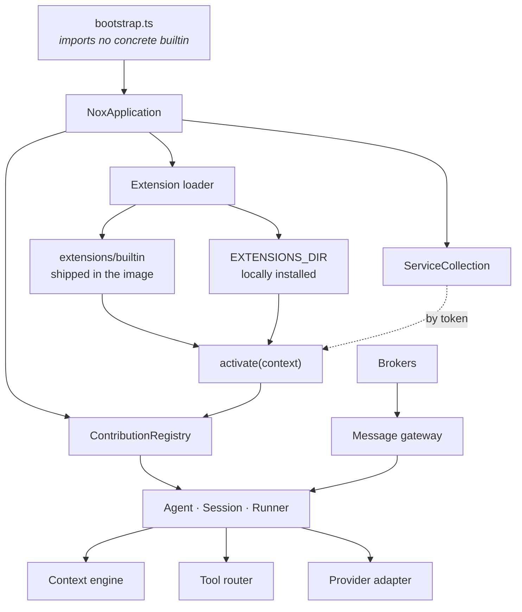

# Architecture

Nox is a **kernel** plus **contributions**. The kernel owns the laws and imports
nothing concrete: when it needs a capability it declares a *contribution point*,
and something fills it. Builtins are contributions too — they differ from
third-party code only in how they are loaded, never in what they are.

| Term | Meaning |
|---|---|
| **Contribution point** | A typed slot the kernel declares — `ContributionPoint<T>` |
| **Contribution** | A concrete capability registered against a point |
| **Extension** | A packaged unit of contributions with a lifecycle. One extension may fill several points |
| **Service** | A host-owned dependency handed out by token, never a global |

The practical consequence is a rule you can check by grep: `src/bootstrap.ts`
imports no concrete builtin. Removing every package under
`src/extensions/builtin/` leaves a runtime that starts, has no provider, no
transport and no memory, and is still correct.

---

## The contribution points

Every point is declared in the public package, not in `src/`. That is
deliberate: a point is a contract with code Nox did not write, so it lives where
third-party code can import it.

| Point | Contract | Builtins today |
|---|---|---|
| `nox.providers` | `ProviderContribution` | `openai`, `local` |
| `nox.brokers` | `BrokerContribution` | `web`, `discord` |
| `nox.memories` | `MemoryContribution` | `semantic` |
| `nox.toolsets` | `ToolSetContribution` | `web`, `config`, `cronjobs` |
| `nox.commands` | `Command` | `session` |
| `nox.languages` | `LanguagePack` | `en`, `es` |
| `nox.translations` | `TranslationFragment` | contributed by extensions that own UI copy |
| `nox.authorities` | `AuthorityContribution` | declared alongside whatever they guard |

Declarations live in [`packages/extension-api/src/`](../packages/extension-api/src/),
one file per domain: `providers.ts`, `brokers.ts`, `memory.ts`, `tools.ts`,
`commands.ts`, `content.ts`, `artifacts.ts`, `schemas.ts`, `untrusted.ts`.

> **Note.** Not every extensible seam is a contribution point. Artifact
> processors — the Sharp image builtin among them — register against a
> *service* (`artifacts.processors.register(...)`) rather than a point, because
> the pipeline owns their ordering and cache versioning. Both are public; they
> differ in who owns the lifecycle.

---

## Services

A service is a host-owned dependency handed to an extension by token. There is
no global, no ambient singleton, and no way to reach the host except through a
token the activation context can resolve.

| Token | What it hands over |
|---|---|
| `configService` | The validated configuration snapshot |
| `configAdminService` | The administration boundary: entry CRUD, reload, retry, revert |
| `secretStoreService` | Secret *metadata* and redacted handles — never values |
| `loggerService` | The structured logger |
| `dataDirectoryService` | The resolved `DATA_DIR` path |
| `artifactPipelineService` | Artifact ingestion, renditions and the processor registry |
| `chatHubService` | The chat surface brokers and the API share |
| `modelAccessService` | Model calls routed through the runtime's own policy |
| `runtimeActivityService` | Whether the runtime is busy — what idle-triggered work waits on |
| `scheduledRunHostService` | Opening a fresh session for a scheduled occurrence |

Host-side, each token is narrowed back to its concrete implementation type
without widening the public API — see [`src/services.ts`](../src/services.ts).

---

## The composition root

[`src/application.ts`](../src/application.ts) is the only place that assembles
the runtime. `NoxApplication` owns the registry, the service collection, the
loaded extensions, the live sessions and one `DisposableStore` for everything
that must be released.

Activation is transactional per package: a failure rolls back that package's
contributions and leaves every healthy package running. Duplicate IDs disable
every conflicting candidate rather than letting one win by load order.

---

## Discovery

Nox discovers extension packages at startup from two roots:

- **`extensions/builtin`**, beside the runtime — packages shipped in the image.
  Its location is intentionally not configurable.
- **`EXTENSIONS_DIR`** — locally installed packages, defaulting to
  `DATA_DIR/extensions`.

Origin is inventory metadata, not a different execution path. Both roots use the
same manifest parser, compatibility checks, module loader, activation context,
contribution registry and failure isolation. A broken or incompatible package is
reported by the control plane without being activated.

Authenticated owners can inspect discovery and activation state through
`GET /api/extensions`: Extension API version, package origin, version, state,
sanitized errors and contributed IDs — but no absolute filesystem paths.
Discovering an extension never silently creates a configured instance.

---

## Multiplicity

How many instances a contribution can have is the contribution's own
declaration, not a property of the section it belongs to. `instances` defaults
to `single`, because that is the ordinary case: a transport is bound to one
credential, and a capability like scheduling or configuration access belongs to
*this* Nox rather than to a service outside it.

`many` is the exception a contribution states out loud. It is right when an
instance is the address of an independent remote service a deployment genuinely
wants several of, with consumers choosing between them — today, the
OpenAI-compatible provider adapter.

A `single` contribution **owns its own name**: its entry must be called exactly
what the contribution is called, which is also its config `type`. One rule does
two jobs. It reserves the name — `web` is the browser transport's by being
called `web` — and it makes a second instance impossible, because two entries
cannot share one key.

Because a `single` contribution owns its name, a section can describe what it
*could* hold and not only what it holds: `GET /api/config` carries a compact
`contributions` list per section — type, extension, multiplicity, and whether it
is configured. Settings draws the unconfigured singletons as rows to fill in.

> **Upgrading.** The naming rule is enforced when a section loads, so a
> configuration written before it existed can name a singleton's entry anything
> and stop validating on upgrade. Renaming is the whole fix, and it is two edits:
> the entry in its own file, and everything that referenced the old name — a
> blueprint granting a tool set, a blueprint naming a provider. The failure is
> reported per component rather than fatally, and the last working generation
> stays in service while it is corrected.

---

## The message gateway

A **broker** is a transport into the message gateway. It delivers what arrived
and renders what it is handed, and knows nothing about agents, sessions or the
transcript. Everything about which events a given transport draws is in
[extensions/brokers.md](extensions/brokers.md).

Two things stay with the gateway rather than the transport, because they are not
rendering questions: what another participant said, and which principal was
allowed to use which authority. Both are about who may see what.

---

## Trust boundary, stated plainly

Extensions are trusted native code, not a sandbox.

The loader `import()`s a package from disk into the Nox process, so an extension
runs with everything the runtime has: the data directory and its `.secret-key`,
the SQLite database, the network, the filesystem. `SecretMetadataReader`
deliberately exposes metadata and never values, and `context.storage` is isolated
per extension ID — but neither is a boundary. They are conveniences an extension
can simply decline to use.

That is acceptable while every package ships in the image. It stops being
acceptable the moment a person can install a third-party one, and that is exactly
what un-defers the work. It needs, at minimum:

- a declared permission model in the manifest — filesystem, network, services —
  that the host **enforces** rather than documents;
- an execution boundary an extension cannot reach around: a worker with a
  restricted module graph, a separate process behind the existing typed-token
  RPC, or WASM for the pure cases;
- `origin` meaning a privilege level instead of an inventory label;
- an install-time disclosure that says plainly what the package will reach.

Until then, installing an extension is granting the machine, and any UI that
offers installation has to say so in those words.

---

## The size of the public surface

`@nox/extension-api` is the single declaration of types the kernel also consumes
— `Message`, `MessageContent`, `MessageOrigin` and the whole outbound event
vocabulary live there rather than in `src/`. That removes duplication and the
drift that comes with it, and it moves the coupling instead of removing it: a
change to a kernel domain type is now a change to a versioned public contract.

The contract tests cover schema behavior, not the shape of every exported
interface, and the package is committed under semver before a single third-party
extension has exercised it. `0.x` is the room to be wrong in; the discipline is
to spend it deliberately. When a real external consumer appears, expect one
compaction pass of the surface — and take it while the major is still `0`.
