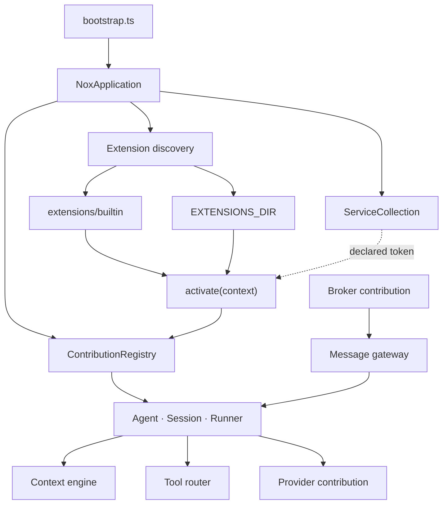

# Architecture

Nox is organized as a kernel plus extension contributions. The kernel defines
contracts and composes registered capabilities; builtin providers, brokers,
memories, tool sets, commands, and language packs are loaded as extension
packages.

This is an architectural boundary in the current source, not a claim of security
isolation. [`src/boundaries.test.ts`](../src/boundaries.test.ts) checks that
builtin packages are not imported by kernel files and that the public Extension
API does not import kernel source.

| Term | Meaning |
|---|---|
| **Contribution point** | A typed registry slot such as `ContributionPoint<T>` |
| **Contribution** | A capability registered against a contribution point |
| **Extension** | A package with a manifest, activation lifecycle, and zero or more contributions |
| **Service** | A host-owned dependency exposed to an extension through a typed token |

---

## Contribution points

Contribution-point declarations live in the public
[`@nox/extension-api`](../packages/extension-api/) package so extension code and
the kernel consume the same contract.

| Point | Contract | Builtins in the current tree |
|---|---|---|
| `nox.providers` | `ProviderContribution` | `openai`, `local` |
| `nox.brokers` | `BrokerContribution` | `web`, `discord` |
| `nox.memories` | `MemoryContribution` | `semantic` |
| `nox.toolsets` | `ToolSetContribution` | `web`, `config`, `cronjobs` |
| `nox.commands` | `Command` | `session` |
| `nox.languages` | `LanguagePack` | `en`, `es` |
| `nox.translations` | `TranslationFragment` | fragments owned by extensions |
| `nox.authorities` | `AuthorityContribution` | authorities registered by their owning package |

Declarations are grouped by domain under
[`packages/extension-api/src/`](../packages/extension-api/src/), including
providers, brokers, memory, tools, commands, content, artifacts, schemas, and
untrusted-data helpers.

Not every extensible registry is a contribution point. Artifact processors, for
example, register through the artifact-pipeline service because that service owns
processor selection and rendition cache versioning. Both APIs are public, but
their lifecycle owners differ.

---

## Host services

An activation context contains a service container. Extensions resolve
host-owned dependencies with public tokens rather than receiving the concrete
application object.

| Token | Value exposed through the host API |
|---|---|
| `configService` | Validated configuration snapshots |
| `configAdminService` | Entry CRUD, reload, retry, and revert operations |
| `secretStoreService` | Secret metadata and redacted handles, not values |
| `loggerService` | Structured logger |
| `dataDirectoryService` | Resolved `DATA_DIR` path |
| `artifactPipelineService` | Artifact ingestion, renditions, and processor registry |
| `chatHubService` | Chat surface shared by brokers and the API |
| `modelAccessService` | Model calls routed through configured providers |
| `runtimeActivityService` | Current runtime activity state |
| `scheduledRunHostService` | Opening a new session for a scheduled occurrence |

Host-side token narrowing is in [`src/services.ts`](../src/services.ts).

Each extension manifest can declare a `services` list. At activation,
`ServiceCollection.scoped` creates a container that resolves only those declared
IDs. An undeclared token raises `UndeclaredServiceError`; a declared token the
host does not provide follows the existing missing-service behavior. Installed
extensions are also prevented from requesting tokens marked as control-plane
services.

This controls the service API handed to extension code. It does not prevent that
code from using process-level APIs, so it should not be described as a sandbox.
The distinction is covered further under [Trust boundary](#trust-boundary).

---

## Composition root

[`src/application.ts`](../src/application.ts) assembles the runtime.
`NoxApplication` owns the contribution registry, service collection, loaded
extensions, live sessions, and disposables.

Activation is transactional per package in the current implementation: if
activation fails, registrations from that activation are rolled back while
other packages can continue. Duplicate manifest IDs are reported as conflicts
instead of selecting a package by discovery order. Representative cases live in
[`loader.test.ts`](../src/extensions/loader.test.ts) and
[`application.test.ts`](../src/application.test.ts).

---

## Discovery

At startup, Nox scans two roots:

- `extensions/builtin`, beside the runtime image;
- `EXTENSIONS_DIR`, defaulting to `DATA_DIR/extensions`.

Both roots pass through the same manifest parser, compatibility checks, loader,
activation context, and contribution registry. Their `origin` values are
inventory metadata; they do not create separate process-level trust boundaries.

The authenticated `GET /api/extensions` route exposes the Extension API version,
origin, package version, state, sanitized error, and contributed IDs. Absolute
filesystem paths are omitted. Discovery by itself does not create configured
provider, memory, broker, or tool-set instances.

---

## Contribution multiplicity

A contribution declares `instances: 'single' | 'many'`; the default is `single`.
The declaration belongs to the contribution type, while configuration keys name
configured instances.

The current convention for a `single` contribution is that its configuration key
matches its contribution ID. That prevents two entries for the same singleton
and lets Settings show whether a known singleton has been configured. The
OpenAI-compatible provider declares `many`, allowing several configured
endpoints of that provider type.

This naming convention is validated while loading configuration. An older or
hand-written file that gives a singleton another key can fail validation after
an upgrade. Correcting the entry key and references to it is the migration path;
the failure remains visible through configuration status.

---

## Message gateway

A broker is a transport into the message gateway. It delivers inbound content
and renders outbound events according to its declared capabilities. Agent,
session, and transcript behavior stays behind the gateway.

Principal identity and authority checks remain gateway/runtime concerns rather
than presentation choices. Rendering differences between the web and Discord
brokers are documented in [extensions/brokers.md](extensions/brokers.md).

---

## Trust boundary

Extensions currently run as trusted in-process code.

The loader uses `import()` on an extension entry module. As a result, extension
code executes with the operating-system permissions of the Nox process and can
potentially access the filesystem, network, data directory, database files, and
local secret key through process APIs. `context.storage`, redacted secret
handles, declared host services, and namespace checks provide useful host
contracts, but they do not contain code that bypasses those contracts.

The current manifest and activation checks do provide narrower, testable
behavior:

- host service IDs are declared and scoped before activation;
- installed packages cannot request control-plane service tokens, and one that
  declares a control-plane service in its manifest is refused at discovery
  rather than at its first call;
- installed packages cannot take an ID inside the reserved `nox.` namespace;
- host-provided package names and compatible versions are checked at discovery;
- extension-owned storage is namespaced by extension ID through the supplied
  storage API;
- the extension inventory reports each package's declared `services` and
  `hostPackages`, including for packages that failed to load, so what a package
  reaches for can be read without opening its manifest.

The namespace check matters because an extension owns authorities under its own
ID. An installed package named `nox.impostor` would own `nox.impostor.*`, which
an existing grant of `nox.*` already covers, and the ID is the only evidence
downstream has. Inside `nox.` nobody owns the whole space: the core is
`nox.core` and owns `nox.core.*` under the same rule extensions follow, and each
builtin owns its own ID's namespace. That makes `nox.core.*` a grant meaning the
core's own capabilities alone, and keeps a builtin from ever being named such
that it covers them.

Those checks reduce accidental coupling through supported APIs. They are not a
permission model for filesystem or network access.

For that reason, operators should review an installed extension as local code
that will run under the Nox account. Supporting untrusted packages would require
an enforceable execution boundary and a permission/disclosure design. None is
implemented today, and the work is not primarily boundary code: the contract
passes live objects by reference and calls synchronously in several places, so
it has to be made able to cross a boundary before one can be added.

A measured note on the options, because one of them does not work: a worker
thread is not a boundary. An extension body in a Bun `Worker` can import
`node:fs`, spawn a child process, read `process.env`, and open sockets. Only a
process confined by the operating system — a dedicated uid, Landlock, seccomp,
or a sibling container — makes filesystem and network declarations enforceable.

The crossings, what each would have to become, and the open decisions are in
[extension-isolation.md](extension-isolation.md).

---

## Public API status

`@nox/extension-api` contains the shared message, event, contribution, service,
and extension types used by both the kernel and extension packages. Keeping one
versioned contract reduces duplicate type definitions, while also making changes
to those domain types public API changes.

The package is currently `0.x` and should be treated as evolving. Contract tests
cover schema and runtime behavior, and the standalone greeting example checks an
independently compiled consumer. They do not prove compatibility with every
possible third-party extension. Before a stable release, changes to the surface
should be expected and documented through semver and migration notes.
