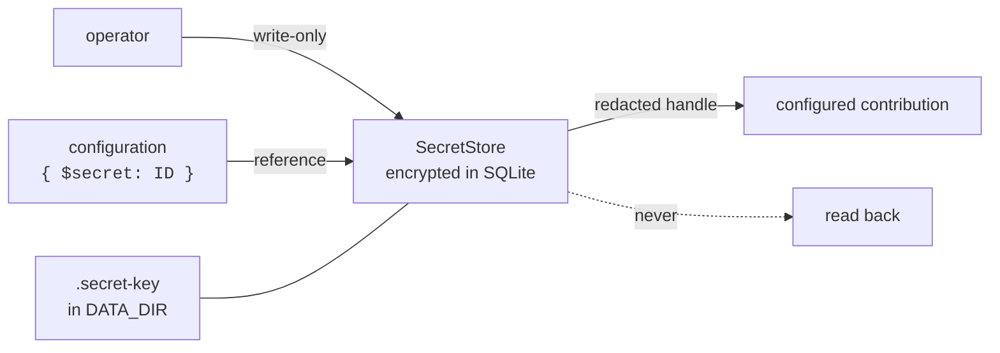

# Configuration

Configuration files represent durable desired state. Many contribution sections
can reconcile while the process is running; process-level settings report when a
restart is required. Representative behavior is covered in
[`src/config/config.test.ts`](../src/config/config.test.ts) and
[`src/bootstrap.test.ts`](../src/bootstrap.test.ts).

---

## Environment

Environment variables currently select storage locations, runtime mode, session
resume, and optional file watching. Application behavior is otherwise described
by the JSON configuration. Variables are defined in
[`src/config/env.ts`](../src/config/env.ts):

| Variable | Default | What it is |
|---|---|---|
| `CONFIG_DIR` | `/etc/nox/config` | Where the JSON configuration files are read from |
| `DATA_DIR` | `/var/lib/nox` | SQLite database, artifacts, and `.secret-key` |
| `EXTENSIONS_DIR` | `DATA_DIR/extensions` | Locally installed extension packages |
| `UI_DIR` | `/app/ui` | Built web UI assets — the output of `bun run build:ui` |
| `CONFIG_WATCH` | off | `1` or `true` enables debounced filesystem reloads |
| `CONFIG_WATCH_DEBOUNCE_MS` | `250` | Debounce window, between 50 and 60000 |
| `NODE_ENV` | `development` | `development`, `production` or `test` |
| `NOX_SESSION_ID` | — | Resumes that session on start |

The defaults are container paths. For local development, point them somewhere
inside the repo:

```bash
export CONFIG_DIR=./.nox/config
export DATA_DIR=./.nox/data
export UI_DIR=./src/ui/dist
```

---

## The sections

Configuration is split into files, each one a section with its own Zod schema.
`applies` is part of the section's declaration, not a guess made at runtime:

| File | Holds | Applies |
|---|---|---|
| `app.json` | Process, UI, authentication, and storage settings | mixed: some hot, some restart-scoped |
| `blueprints/*.json` | One agent blueprint per file | hot |
| `brokers.json` | Transport instances | hot |
| `memories.json` | Memory instances | hot |
| `providers.json` | Provider instances | hot |
| `toolsets.json` | Tool-set instances | hot |

A failed candidate remains saved and visible while its **last valid generation
keeps serving**. Settings offers retry, revert, and an explicit
**Reload mounted config** action — which stays available even when the watcher
is enabled.

HTTP listen address, SQLite structure and path, and artifact storage
construction report `restartRequired` rather than claiming to have changed live.

---

## `app.json`

```json
{
  "api": { "host": "0.0.0.0", "port": 8080 },
  "artifacts": { "maxArtifactBytes": 104857600, "maxStorageBytes": 10737418240 },
  "auth": {
    "accessTtlSeconds": 900,
    "refreshTtlSeconds": 2592000,
    "secureCookies": false
  },
  "database": { "path": "nox.db", "busyTimeoutMs": 5000, "synchronous": "normal" },
  "logLevel": "info",
  "timezone": "UTC",
  "ui": { "locale": "en" }
}
```

| Key | Default | Notes |
|---|---|---|
| `api.host` / `api.port` | `0.0.0.0` / `8080` | Restart to change |
| `artifacts.maxArtifactBytes` | 100 MiB | One upload's ceiling |
| `artifacts.maxStorageBytes` | 10 GiB | All unique originals and renditions. Must be ≥ `maxArtifactBytes` |
| `auth.accessTtlSeconds` | 15 min | Short on purpose; a revoked session is caught by the guard anyway |
| `auth.refreshTtlSeconds` | 30 days | How long a login survives without use |
| `auth.secureCookies` | `false` | Turn on behind TLS. Off by default because an ordinary Nox is `http://localhost:8080`, and a cookie the browser refuses to send is a login that silently never persists |
| `database.synchronous` | `normal` | SQLite durability mode |
| `logLevel` | `info` | Hot |
| `timezone` | `UTC` | IANA zone — see below |
| `ui.locale` | `en` | Interface language. Hot |

### Message timestamps and `timezone`

Messages rendered for a model include their recorded time in the configured
zone:

```text
[from wirhoss · 2026-08-23 14:14 GMT-6]
```

The system prompt does not receive a continuously changing clock. Instead, the
latest message timestamp gives the model temporal context as of that message.
Because the stored timestamp is rendered again during replay, it does not change
merely because the session was reopened. This is not a guarantee that the model
knows the wall-clock time after a long idle period.

---

## Secrets

Ordinary configuration schemas accept secret references rather than plaintext
credentials. Nox stores supplied values as encrypted database records. The
current administrative API can create, replace, and delete those values, but it
does not provide an operation that reads a value back. Configuration contains a
reference:

```json
{ "apiKey": { "$secret": "OPENAI_API_KEY" } }
```

The store generates `.secret-key` in `DATA_DIR` and requests owner-only file
permissions. Deployment filesystem and backup permissions still need to be
managed by the operator.

> **Back up that key together with the database.** Losing it makes the encrypted
> values intentionally unrecoverable.

Values reach configured contributions as **redacted snapshot handles**, never as
strings in a config object. Rotating a secret reconciles the replacement
provider, memory, tool-set, agent and broker generations; work already in flight
finishes against its immutable snapshot.

The current implementation does not resolve credential values from environment
variables or mounted secret directories. Values enter through the write-only
secret administration surface.



---

## Reconciliation

A configuration change produces a new *generation* of every component that
depends on it. The old generation keeps serving until the new one activates
successfully.

- A component that fails to build is reported **per component**, not fatally.
- The last working generation stays in service while the failure is corrected.
- A live session's configuration snapshot stays stable: a change that lands
  mid-call takes effect on the next one, not this one.

An agent can administer this same desired state through the `config` tool set —
see [extensions/configuration.md](extensions/configuration.md).
