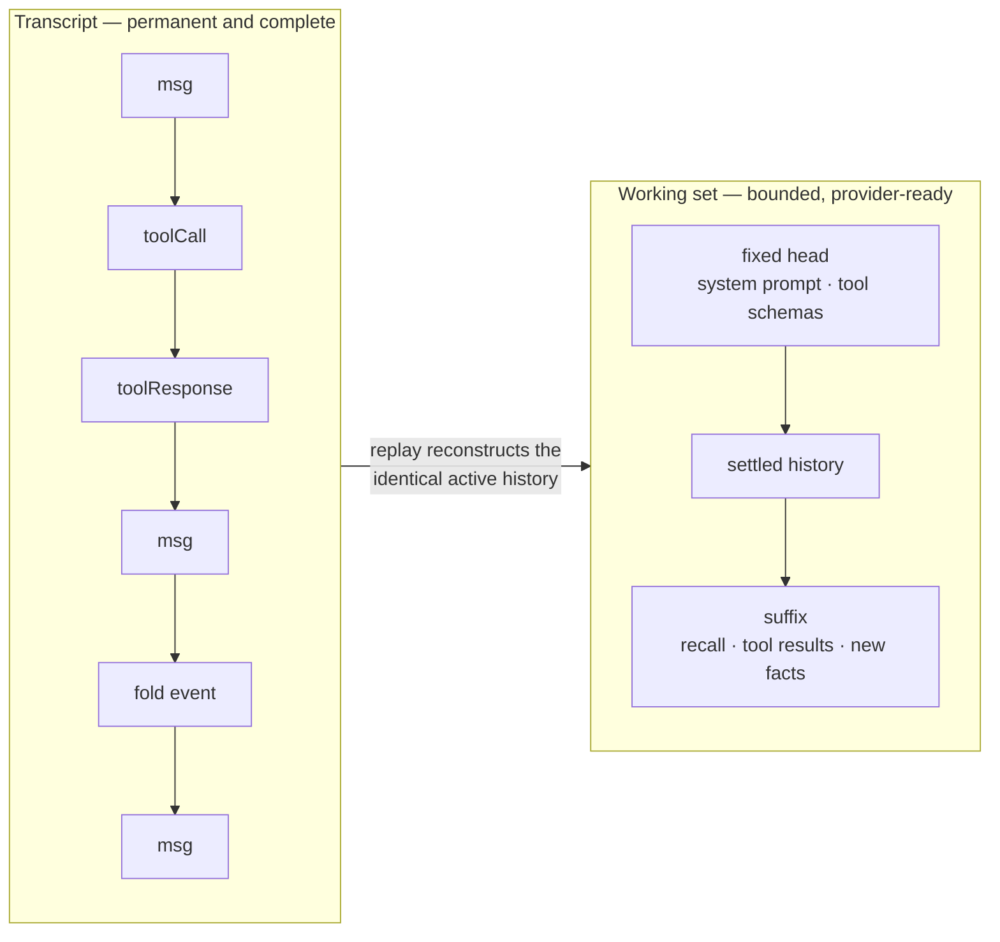

# The context engine

This is the part of Nox that the [three laws](../README.md#the-three-laws) exist
to protect. Everything here lives in
[`src/agent/context/`](../src/agent/context/).

---

## Two objects, not one

The single most important distinction in Nox: **history is not context.**



The transcript is append-only and never loses anything. The working set is what
actually goes to the provider, and it is bounded. `Context` exposes both, and the
method names are the contract:

| Method | Returns |
|---|---|
| `getFullHistory()` | The transcript — everything, including fold and compaction events |
| `getHistory()` | The working set — what the next request will carry |
| `getSystemPrompt()` | The fixed head's instructions |
| `getTools()` | Tool schemas, in deterministic name-sorted order |
| `getTokenEstimate()` | The current working-set estimate |
| `getUsage()` | `ContextUsage` — what the last request actually cost |
| `isUnderPressure()` | Whether the budget has been exceeded |
| `addMessage(message)` | Appends. **Always appends.** |

Fold and compaction events are messages in the transcript like any other. They
are not deletions, and "deleted to save space" is never the mechanism.

---

## Folding

Folding collapses mechanical traffic — tool calls and their responses — by rule.
It is deterministic, it is reversible by replay, and the original messages are
still in the transcript.

The placeholder a fold leaves behind carries only what the model cannot
reconstruct on its own: **what was called, its Track ID, and whether it worked.**
Arguments are truncated at 200 characters. Everything else is still in the
transcript and retrievable by that Track ID.

### A fold must earn its place

A fold that merely breaks even makes the request no smaller. So the reduction is
**measured in tokens before it is applied**, and rejected if it is not worth it:

```ts
const DEFAULT_MIN_REDUCTION_RATIO = 0.2;   // src/agent/context/fold.ts
```

A fold must cut at least 20% of what it replaces, or it does not happen.

### Invariants

`applyFold` throws rather than producing a subtly wrong history. A fold that
folds nothing, a fold that names the same message twice, and a fold that
contains itself are all errors, not edge cases.

### When it runs

A settled tool loop tries folding before a later request may compact. Folding
never runs in the middle of a tool loop just because token pressure rose — the
model has to consume the tool results first.

---

## Compaction

Compaction is model-assisted and **lossy**. It is the last resort, not a routine
step, and never a background convenience.

### No budget, no compaction

Without a configured context window there is no pressure signal, and `compact()`
is a no-op. This is not a limitation to work around. Summarizing lossily on a
guess is not a smaller version of compaction — it is precisely the thing
compaction is the last resort *for*, performed for no reason. An agent takes its
window from the model unless its own policy sets one.

### It cannot cut a tool loop in half

A compaction boundary is never allowed to land between a `toolCall` and its
`toolResponse`. `isSafeCut` rejects those positions and `seekSafeCut` walks the
boundary outward until it finds a legal one:

```ts
function isSafeCut(history, index) {
  if (history[index - 1]?.role === 'toolCall') return false;
  if (history[index]?.role === 'toolResponse') return false;
  return true;
}
```

A model handed a call with no result, or a result with no call, will explain the
inconsistency instead of answering the question.

### Invariants

The same three as folding: a compaction must replace something, must not name a
message twice, and must not contain itself. It must also find every message it
claims to replace, and they must be contiguous once located.

---

## Pressure and token accounting

Pressure is measured **before** the provider rejects the request, not after.

The estimator in [`tokens.ts`](../src/agent/context/tokens.ts) is deliberately
cheap and deliberately conservative — it is a budget signal, not a billing
record:

| Constant | Value |
|---|---|
| Characters per token | 3 |
| Per-message overhead | 6 |
| System prompt overhead | 4 |
| Per-tool overhead | 8 |
| Image | 1024 |
| Audio / document | 2048 |
| Video | 4096 |

Serialization for estimation is stable — the same message estimates the same
number every time, including cycle-safe object traversal — because an estimate
that drifts would make folding's reduction check meaningless.

When a provider reports real usage, `recordInputUsage()` takes it. Estimates are
what Nox uses when nobody has told it better, not what it prefers.

---

## Bounded retrieval

Retrieval must never quietly undo the space that folding and compaction
reclaimed. The history tool set (`nox.history`) is the search surface over the
transcript, and it is budgeted:

| Tool | What it does |
|---|---|
| `history_search` | Full-text search across the transcript |
| `history_sessions` | List sessions |
| `history_sessions_search` | Search across sessions |
| `history_read_result` | Read one folded tool result back by Track ID |

Results are capped at **6000 characters** by default, and a truncated result says
so in the payload rather than silently returning less. Ranking uses SQLite FTS5's
`bm25()` over an index built for this purpose, with diacritics folded to match
the way the tokenizer normalizes.

> **A note on BM25.** Lexical ranking is used in exactly two places: transcript
> search here, and tool search in [`src/tool/router.ts`](../src/tool/router.ts).
> The semantic memory has **no** lexical arm — its retrieval is vector-only. See
> [extensions/memory.md](extensions/memory.md).

---

## Replay is the source of truth

A persisted transcript must reconstruct the identical active history. That is
what makes folding safe to call reversible, and it is what makes the whole
scheme auditable: every reduction is an event you can find, with the original
still sitting next to it.
