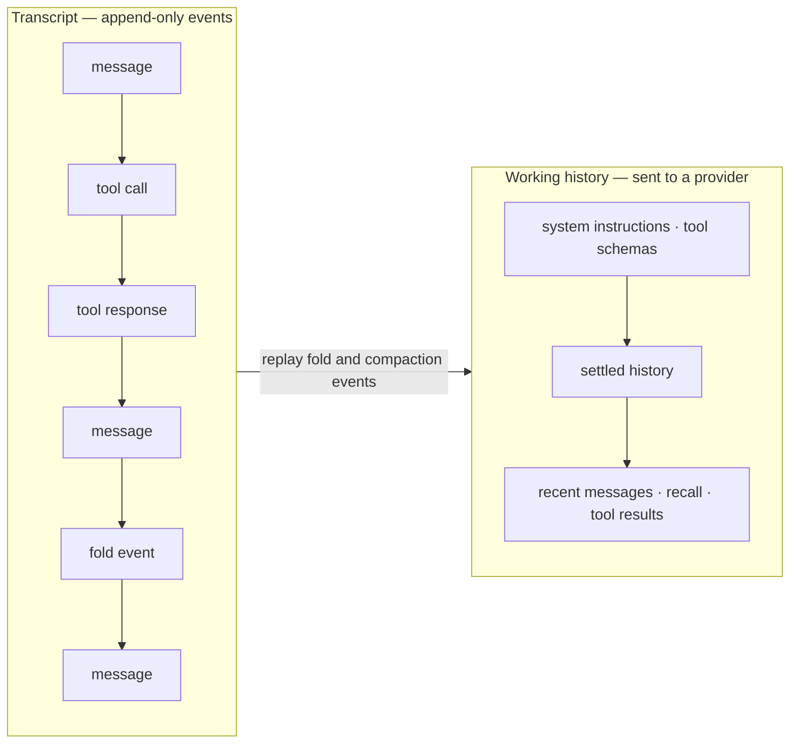

# The context engine

The context engine implements Nox's current approach to request history, folding,
compaction, and token-pressure estimates. It lives in
[`src/agent/context/`](../src/agent/context/) and has focused tests in the same
directory.

The design goals in the [README](../README.md#design-goals) explain the intended
direction. This page describes current behavior; it does not claim measured cost
or quality improvements.

---

## Transcript and working history

Nox keeps two related views of a session:



The transcript records appended messages plus fold and compaction events. The
working history is reconstructed from those events and is the history supplied
to the provider. It can be reduced when folding or compaction applies; without a
configured budget it is not guaranteed to stay below a particular size.

`Context` exposes the distinction through these methods:

| Method | Current result |
|---|---|
| `getFullHistory()` | Transcript events, including fold and compaction events |
| `getHistory()` | Active provider-facing message history |
| `getSystemPrompt()` | Session system instructions |
| `getTools()` | Tool schemas in name-sorted order |
| `getTokenEstimate()` | Current local estimate for the active history |
| `getUsage()` | Context window, pressure threshold, and estimated usage |
| `isUnderPressure()` | Whether estimated usage exceeds the configured threshold |
| `addMessage(message)` | Appends an immutable message snapshot |

The implementation and replay cases are covered by
[`context.test.ts`](../src/agent/context/context.test.ts),
[`transcript.test.ts`](../src/agent/context/transcript.test.ts), and the fold and
compaction tests.

---

## Folding

Folding targets settled tool calls and responses. It creates a smaller transcript
event while leaving the original events available in the full transcript.
Replaying the transcript applies the fold event again to reconstruct the active
history.

The folded representation records the tool name, Track ID, truncated arguments,
and outcome. Arguments are limited to 200 characters. Full tool results remain
available through the history tool set by Track ID.

### Reduction threshold

Before applying a fold, Nox estimates the messages it would replace and the fold
event it would add. The current default minimum reduction is:

```ts
const DEFAULT_MIN_REDUCTION_RATIO = 0.2; // src/agent/context/fold.ts
```

With the default, a candidate needs an estimated reduction of at least 20%.
Candidates below the configured threshold are left unchanged. This is based on
the local estimator, not provider billing data.

### Validation

`applyFold` rejects malformed events, including an empty replacement list,
duplicate message references, self-reference, and references that cannot be
found in the active history. Those are implementation invariants with coverage
in [`fold.test.ts`](../src/agent/context/fold.test.ts).

### When automatic folding runs

When a model turn returns no new tool calls, the current tool loop is settled and
the runner calls `context.fold()`. This happens independently of the context
window or pressure threshold. The call can still be a no-op when there is no
eligible tool traffic or the candidate does not meet the reduction threshold.

Before each later provider request, the runner also calls the unforced
`context.compact()`. That method returns immediately when no budget reports
pressure. Under pressure it rechecks settled folding before considering lossy
compaction. Tool traffic the model has not yet consumed is excluded from both
reduction paths.

The no-budget regression is covered in
[`longSession.test.ts`](../src/agent/longSession.test.ts): folding occurs while
automatic compaction remains absent.

---

## Compaction

Compaction asks a chat model to summarize a selected range of active history. It
is lossy because the summary may omit details, even though the original messages
remain in the transcript.

### Automatic and requested compaction

For automatic compaction, Nox needs a configured pressure threshold derived from
a context window or explicit context policy. If there is no threshold, or the
estimate is below it, the automatic pass returns without compacting.

A person can explicitly request compaction through the session command. That path
uses a forced pass and is not blocked by the absence of an automatic pressure
threshold. It still needs a selectable history range and rejects a generated
summary that does not reduce the local token estimate.

### A provider `context_limit` can force compaction without a budget

The absence of a configured context window disables automatic compaction; it
does not prevent recovery from a provider's `context_limit` response.

On that response, the runner first retries without the temporary user-shaped
message that contains long-term memories retrieved for this request, when one is
present. That message exists only in the provider request: omitting it does not
delete stored memories or a transcript event. If the provider still reports
`context_limit`, the runner calls `context.compact({ force: true })`. The forced
pass attempts settled folding and then may run model-assisted compaction without
consulting a local pressure threshold. If either operation reduces the working
history, Nox retries the provider request once; otherwise it surfaces the
original refusal.

The recovery flow has coverage in
[`runner.test.ts`](../src/agent/runner.test.ts).

### Tool-call boundaries

A selected compaction range cannot begin between a `toolCall` and its
`toolResponse`. `isSafeCut` checks candidate boundaries, while `seekSafeCut`
moves a boundary to a valid position:

```ts
function isSafeCut(history, index) {
  if (history[index - 1]?.role === 'toolCall') return false;
  if (history[index]?.role === 'toolResponse') return false;
  return true;
}
```

This preserves complete call/response pairs in the active history outside the
summary range.

### Validation

Compaction events reject empty ranges, duplicate references, self-reference,
missing messages, and non-contiguous ranges. See
[`compact.test.ts`](../src/agent/context/compact.test.ts).

---

## Pressure and token accounting

The estimator in [`tokens.ts`](../src/agent/context/tokens.ts) is a local
heuristic used for pressure decisions. It is not a tokenizer for every supported
model and should not be read as a billing record.

| Heuristic constant | Current value |
|---|---|
| Characters per token | 3 |
| Per-message overhead | 6 |
| System prompt overhead | 4 |
| Per-tool overhead | 8 |
| Image | 1024 |
| Audio or document | 2048 |
| Video | 4096 |

Estimation uses stable serialization, including cycle-safe traversal, so the same
local value produces a repeatable estimate. That repeatability is useful for
comparing a candidate fold with the messages it would replace, but it does not
prove accuracy for a particular provider.

When a provider reports actual input usage, `recordInputUsage()` stores the
difference between that count and the estimate for the same request. Later local
changes use estimated deltas until another provider report refreshes the anchor.
The estimator may still over- or under-count model-specific input.

---

## Bounded transcript retrieval

The history tool set (`nox.history`) is the search surface over persisted
transcripts:

| Tool | Current purpose |
|---|---|
| `history_search` | Full-text search in a transcript |
| `history_sessions` | List sessions |
| `history_sessions_search` | Search across sessions |
| `history_read_result` | Read a folded tool result by Track ID |

Results default to a 6,000-character cap. A truncated result includes continuation
information in its payload. Transcript and tool search use SQLite FTS5 with
`bm25()` ranking; semantic-memory retrieval is separate and vector based. See
[extensions/memory.md](extensions/memory.md).

The cap bounds each retrieval result. It does not by itself guarantee that an
entire provider request fits a model window; that still depends on the configured
context policy and other request content.

---

## Replay

When a `Context` is created from persisted events, it iterates through the
transcript and applies fold and compaction events to rebuild active history. The
expected equivalence is tested in the context and transcript suites.

This event-based approach makes reductions inspectable and reproducible by the
current implementation. It should still be treated as a versioned behavior:
changes to event schemas or replay semantics need migrations and regression
coverage as the project evolves.
