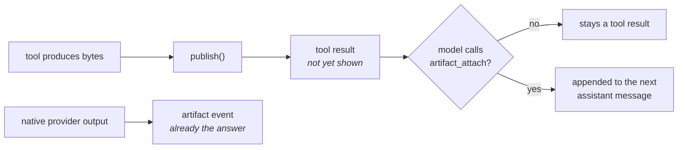

# Artifacts

Uploaded files do not live in messages, and they do not live in SQLite. SQLite
holds metadata only.

---

## Ingestion

The authenticated artifact API streams raw request bytes into `DATA_DIR/artifacts`,
hashes them while writing, detects their media type, and returns a small
`ArtifactRef`.

```http
POST /api/artifacts
Authorization: Bearer …
Content-Type: image/webp
X-Artifact-Filename: diagram.webp

<raw bytes>
```

Immutable blobs are addressed by **SHA-256**, so separate uploads keep their own
filename, provenance and access scope while identical bytes occupy disk once.

Messages carry the reference, never the bytes:

```json
{ "type": "artifact", "artifact": { "…": "…" } }
```

The chat ingress resolves that ID again under the authenticated account and
**replaces every client-supplied metadata field with the canonical record**
before it reaches the transcript.

### Limits

| Setting | Default | Bounds |
|---|---|---|
| `artifacts.maxArtifactBytes` | 100 MiB | One upload |
| `artifacts.maxStorageBytes` | 10 GiB | All unique originals and renditions |

Deduplicated references consume no additional quota. A new blob is refused
*before* its final path or metadata commits when storage is full.

---

## Reading bytes back

Through the authenticated `GET /api/artifacts/:artifactId/content` route.
Conversation-owned output includes its conversation ID in that request.

The web client fetches the response as a blob rather than embedding file bytes in
base64 JSON. Stored images are requested when their placeholder enters the
viewport, while audio, video, and documents remain references until the operator
opens or downloads them.

---

## Output: the path is bidirectional

Every user-facing run receives a host-owned `ArtifactOutputSink`, exposed to a
provider as `TextGenerateOptions.artifactOutput` and to an executing tool as
`ToolContext.artifacts`.

A producer streams bytes into `publish(...)`. **Nox — not the producer — assigns
the conversation scope and the provider/tool provenance**, and returns a
`ContentArtifact` containing only the canonical reference.

### Creation does not imply presentation



Tool artifacts remain tool results until the model explicitly calls the core
`artifact_attach` tool for each file it has decided the user should receive.
Tools that declare `output: { artifacts: true }` receive a provider-visible
notice explaining that selection step and forbidding inline or base64 file bytes.

Selections are appended to the next assistant message, or emitted alone if the
run ends before another assistant turn. Native provider output is already the
model's direct answer, so it enters the normalized stream as an `artifact` event
without that step.

Assistant messages, the transcript, brokers and the UI all carry the same
reference, and later model calls replay it as a stable descriptor.

---

## Reading artifacts as text

The core `artifact_read` tool inspects **only IDs already referenced by the
conversation**. It requests the versioned `nox.agent.text-read` representation
profile:

- Compatible textual originals stream in bounded Unicode-character pages.
- Registered deterministic processors may produce and cache textual renditions
  for formats such as PDF or Office documents.
- If no textual rendition exists, it returns the canonical binary reference, so a
  compatible provider can still consume it visually or another specialized tool
  can handle it.

**It never treats arbitrary bytes as text.**

---

## Representation profiles

Artifact modality and model modality are intentionally different concepts.

Consumers resolve bytes through a *versioned representation profile*: accepted
media types, an optional size ceiling, and deterministic transform parameters.

1. A compatible original is returned unchanged.
2. Otherwise the pipeline chooses a registered processor by explicit priority and
   stable ID, writes its output through the same streaming content-addressed
   store, and caches the rendition by **source hash, source media type, complete
   profile, and processor version**.
3. Concurrent requests share the cache entry. Conflicting output under one
   processor version is rejected as a determinism violation.

Every model receives an explicit textual artifact reference. When the selected
model declares image input, the OpenAI adapter asks for its concrete image
profile and materializes the resolved bytes as visual input. If no compatible
rendition exists it **keeps the descriptor** rather than discarding the
attachment or sending an unsupported encoding. A text-only model never
materializes it.

---

## Processors

A processor is registered against a **service**, not a contribution point —
`artifacts.processors.register(...)` — because the pipeline owns ordering and
cache versioning.

The first concrete one is the builtin `nox.processor.sharp`. It registers Sharp
through the same public registry available to future implementations; neither the
artifact pipeline nor the OpenAI adapter imports it.

| | |
|---|---|
| Accepts | SVG, AVIF, GIF, JPEG, PNG, TIFF, WebP |
| Produces | PNG, JPEG, WebP, GIF, AVIF |
| Parameters | Bounded resize, fit, position, background, quality, orientation |

Processing is streamed, timed out, pixel-limited, metadata-stripped, and
cache-versioned with **both** the Sharp and libvips versions.

---

## Pending: retention and deletion

Storage quotas bound growth but do not delete committed artifacts automatically.

Until a lifecycle pass exists, reaching `artifacts.maxStorageBytes` rejects new
unique blobs with a `507` response. The current store does not evict an existing
blob automatically to make room.

A future lifecycle design will need to account for transcript references and
content-addressed deduplication rather than removing files by age alone. Current
design considerations include:

- persist normalized references from messages and active operations, instead of
  discovering them by scanning JSON;
- distinguish deleting a logical `artifactId` from collecting its shared physical
  blob;
- support authorized deletion, pinning, expiration and a configurable grace
  period per scope;
- evict regenerable renditions before immutable originals;
- collect a blob only when no artifact, message, rendition source or in-flight
  operation references it;
- reconcile tombstones, SQLite metadata and filesystem state after crashes, with
  race and restart coverage.
