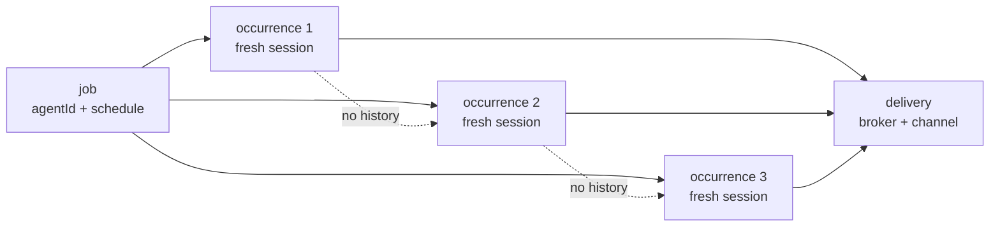
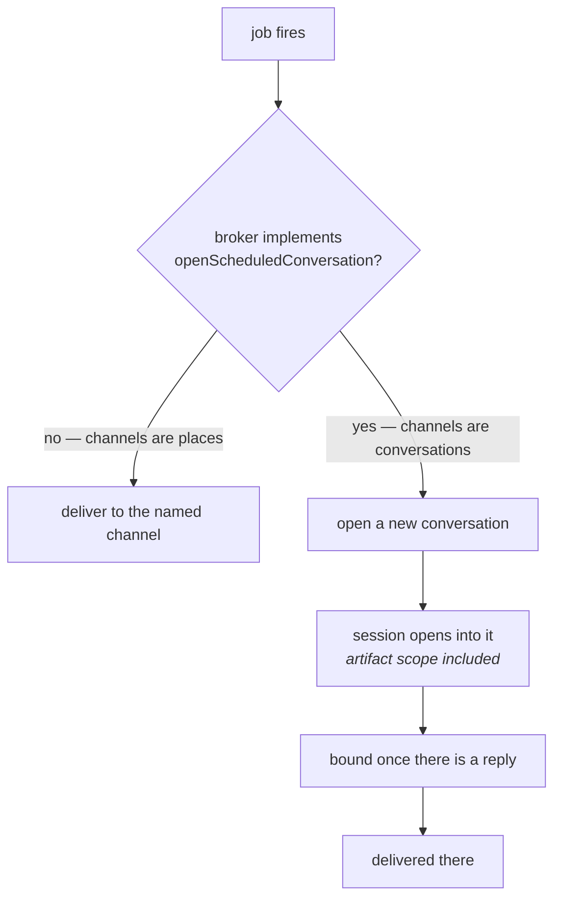

# The `cronjobs` tool set

Durable automations that run in **fresh sessions** of selected configured agents.

---

## Configuring an instance

```json
{
  "cronjobs": {
    "type": "cronjobs",
    "maxJobs": 100
  }
}
```

`maxJobs` bounds the jobs owned by this configured instance — between 1 and 1000,
defaulting to 100.

Grant its management tools directly:

```json
{
  "toolSets": {
    "direct": ["cronjobs"],
    "routed": ["web"]
  }
}
```

---

## Tools

`cron_agents`, `cron_create`, `cron_list`, `cron_get`, `cron_update`,
`cron_delete`, `cron_run`.

---

## What an occurrence is

Every job names an `agentId`. Each occurrence opens a **new session** with that
agent's model, system prompt and selected tools.

**No authoring-chat history enters the run, and no run history enters the next
occurrence.** A scheduled job is not a conversation that resumes; it is the same
instruction executed again from a clean start.



---

## Schedules

A schedule is either **one future ISO 8601 instant** (`at`) or a **recurring
five-field cron expression** (`cron`).

Recurring jobs may name an IANA time zone; otherwise the application time zone
is used.

- Jobs and their run records persist in SQLite, independently of each other.
- A one-time job is **retained disabled** after it runs, rather than deleted.
- Occurrences missed while Nox was stopped are recorded as `skipped` — **never
  replayed in a catch-up burst.** A machine that was off for a weekend does not
  come back and run forty-eight hourly jobs at once.

---

## Delivery

An optional delivery target names a configured broker and channel:

```json
{
  "agentId": "mail-assistant",
  "delivery": { "brokerId": "discord", "channelId": "mail-alerts" }
}
```

### Where a scheduled reply lands

What a "channel" is differs by transport, and that decides where an unattended
run's output can safely go.

A chat service's channel is **a place that outlives every conversation held in
it**. A scheduled reply posted there is just one more message in a room that was
already going. Discord works this way, so delivery goes straight to the named
channel.

A surface whose channels **are** Nox conversations has no such room. The address
names one transcript — and appending to it would drop an unattended run's output
into the middle of a conversation a person is still having, hours later, under a
prompt nobody typed there.

So a transport of the second kind opens a **new** conversation for the reply,
through the optional `Broker.openScheduledConversation()`. The scheduled run is
bound to it, and the reply arrives as its own conversation *beside* the one that
scheduled it rather than inside it. The `web` broker implements this; a transport
whose channels are real places leaves it out.



The address is asked for **before the session opens**, not when the reply is
ready: a transport that answers is saying the run belongs to a conversation of
its own, and that is something the session has to be opened *into* — artifact
scope and all — rather than somewhere to forward its last message.

### The grant is re-checked after the run

Delivery does not trust the broker grant it resolved before the run started. A
broker stopped or replaced while an unattended run was going is exactly the case
where a stale grant would report a delivery that nothing actually made.

The binding happens only once there is a reply worth binding for. On a transport
whose channels are conversations, that binding is what makes the reply readable
afterwards at all — and the transport refuses an address it does not carry, so an
unbound one would be reported as undelivered.

---

## Who a firing acts as

A firing acts as `nox.system:cron`, **not** as the person who created it.

That builtin principal may use the tools exposed by the selected agent's
blueprint. It does not inherit the author's permissions, and it cannot add
capabilities that agent does not have.

The normal Gate still evaluates each call. A system run **cannot approve an
escalation on a human's behalf** — which means a job whose agent needs approval
for something will stop and say so, rather than quietly granting itself
permission at 3 a.m.
