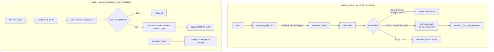

# Semantic memory

> This page was written from the code in
> [`src/extensions/builtin/memories/semantic/`](../../src/extensions/builtin/memories/semantic/).

---

## The contribution point first

`nox.memories` is a **public contribution point, not a vector-store contract**.
An adapter implements two operations:

1. **recall** — bounded context, before a model request;
2. **retain** — the original user/assistant delta, after a run.

Extraction, embeddings, consolidation, deduplication and storage policy remain
the adapter's business. Nox does not tell a memory how to remember.

A blueprint selects **one** configured memory instance. Nox never merges results
from multiple backends — a recall with two authorities is two answers, and
picking between them is a judgement no runtime should make silently.

---

## The builtin

The shipped implementation is `nox.memory.semantic`, a singleton whose config
`type` is `semantic`. It is a vector memory: facts are embedded, stored in a
`vec0` virtual table alongside its own migrated SQLite schema, and retrieved by
distance.

It has **no lexical arm.** Retrieval is vectors only. (Lexical BM25 ranking does
exist in Nox — for transcript search and tool search — but not here. See
[../context-engine.md](../context-engine.md#bounded-retrieval).)



---

## Configuration

```json
{
  "semantic": {
    "type": "semantic",
    "embedding": { "provider": "local", "model": "all-MiniLM-L6-v2" },
    "extraction": { "provider": "big", "model": "qwen38-27b" }
  }
}
```

| Key | Default | What it does |
|---|---|---|
| `embedding` | **required** | The model that vectorizes every fact |
| `extraction` | **required** | The model that decides what is worth remembering |
| `maxRecallFacts` | `20` | How many facts a recall may place in context, before the token budget cuts it further |
| `maxDistance` | *unset* | The relevance floor. Unset means calibrated — see below |
| `mergeDistance` | `0.25` | How close two facts must be before one is folded into the other |
| `contradictionDistance` | `0` (off) | How far apart two beliefs may sit and still be put to the model as a possible conflict |
| `dream.episodes` | `8` | Turns pending before an extraction pass is worth running |
| `dream.idleSeconds` | `90` | How long the runtime must be quiet before a pass may start |
| `dream.maxDelaySeconds` | `1800` | The ceiling, so a busy installation cannot defer forever |

### Why neither model has a default

Both are named rather than defaulted, on purpose.

An embedding model is **half the identity of every vector this store keeps** —
change it and the existing corpus means something else. An extraction model
decides what is remembered at all. Picking either on an operator's behalf would
make a silent choice that shows up months later as a corpus nobody meant to
build.

---

## Distances

All distances are **L2 on the scale `vec0` reports**, which for normalized
vectors runs from `0` to `2`. `2` is the far end: every neighbour is inside it,
so `2` means "no filter".

```text
0 ──────────── 0.25 ─────────── (band) ─────────── maxDistance ────────── 2
  identical    merge             contradiction?     relevance floor        unrelated
```

- **`mergeDistance` (0.25)** is roughly 0.97 cosine similarity — a restatement,
  not a related thought. The asymmetry against the relevance floor is deliberate:
  a recall that returns something unrelated wastes a little context, while a
  merge that folds two different statements together **destroys one of them**.
  Lowering it is always safe. `0` stops merging.
- **`contradictionDistance`** is the upper edge of a band whose lower edge is
  `mergeDistance`. Nearer than that, two facts are a restatement and get merged.
  Further than this, they are two different subjects, and asking would be paying
  a model call to be told so. Only statements about one thing land in between.
  This is the one part of consolidation that costs the extraction model, so it is
  also the one worth turning off — and it defaults to off.

### The relevance floor calibrates itself

`maxDistance` is left unset by default, **and that is the point.**

The distance at which two texts stop having anything to do with each other is a
property of the embedding model, not of this memory. The same number is a strict
filter under one model and no filter at all under another — so shipping a
default would be shipping whichever model it was measured against.

Unset, the memory measures its own model once and keeps the answer beside the
vectors it describes. It does this by embedding a fixed set of **probes**:
about a dozen sentences per language, each on a completely different subject — a
kettle, basalt, migrating storks, a driving test. The distance between any two is
a sample from exactly the distribution the floor exists to reject.

The probes are grouped by language, and that grouping is not decoration: a model
trained mostly on one language packs another language's sentences differently,
and calibrating across the mix would measure the model's language bias instead of
its notion of "unrelated".

Nothing in the probe set is ever stored, recalled, or shown to anyone.

Setting `maxDistance` explicitly pins the floor instead — for an operator who has
swept it themselves with `bun run eval:retrieval`. `2` turns the filter off.

### Why the floor exists at all

Nearest is not the same as near. Without a floor, a question nobody stored an
answer to is still handed the five least-unrelated facts on file, every turn, out
of the same budget a real memory would have used.

---

## The dream pass

Retention is free. Extraction is not, so it is spent in batches.

Doing extraction as each turn ends is the **worst** time available: it is exactly
when the next turn is most likely to start, and on a single-GPU installation the
two contend for the same weights. So turns land in `semantic_episodes`
immediately and cheaply, and the extraction model runs later, on whichever of
three conditions arrives first:

| Trigger | Default | Why |
|---|---|---|
| Enough turns piled up | 8 episodes | The pass is worth its overhead |
| The runtime has been quiet | 90 s | Long enough not to fire while someone reads a reply |
| The oldest turn waited too long | 1800 s | The ceiling |

The third is what keeps a machine that is never idle and never busy enough from
simply never remembering.

---

## Blocks: the memory that is always there

A **block** is one current value that sits in the system prompt whether or not
the conversation went near it — the agent's standing notes about who it is
talking to.

Blocks are a separate table from facts, deliberately. A fact is retrieved, dated,
superseded and ranked; a block is none of those. It is overwritten in place.
Storing them together would mean every query that means *"what do I believe"*
having to remember to exclude the rows that are not beliefs at all.

Blocks are scoped exactly like facts — by agent, issuer and subject — because a
block holds what Nox has been told about one person and must not cross to
another.

---

## Tools

| Tool | What it does |
|---|---|
| `memory_search` | Search facts by meaning |
| `memory_write` | Record a new fact |
| `memory_update` | Revise an existing fact |
| `memory_forget` | Invalidate a fact |
| `memory_block_write` | Overwrite an always-present block |

`memory_block_write` is named in one place in the code rather than inline,
because the system prompt has to tell the agent what to call in order to keep its
blocks current — and a prompt naming a tool that was renamed underneath it is an
instruction the model cannot follow.

---

## Schema

Owned by the extension, in its own migrations directory:

| Table | Holds |
|---|---|
| `semantic_episodes` | Raw turns awaiting extraction |
| `semantic_facts` | Extracted beliefs |
| `semantic_fact_provenance` | Which episode each fact came from |
| `semantic_fact_access` | When a fact was last useful |
| `semantic_fact_contradictions` | Conflicts the model confirmed |
| `semantic_blocks` | Always-present values |
| *(vec0 virtual table)* | The vectors themselves |

---

## Evaluating it

Memory quality is measured, not asserted:

```bash
bun run eval:memory       # extraction quality against expected statements
bun run eval:retrieval    # retrieval quality; use it to sweep maxDistance
bun run eval:quantile     # the calibration quantile sweep
```

`eval:memory` scores drafts against expected statements and reports the
over-extraction failure mode explicitly — facts the model invented that nobody
asked it to keep.
