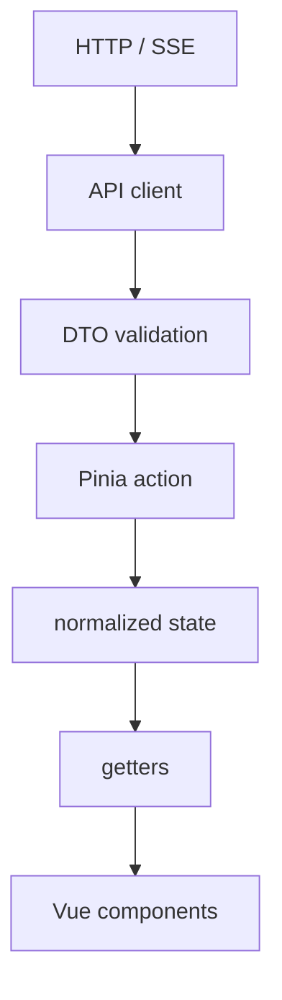

# The web UI

A Vue 3 single-page application served from the runtime. It is a *surface over
Nox*, not a chat client: the runtime remains the source of truth, and the UI
holds a projection of it.

---

## Stack

| Area | Choice |
|---|---|
| Framework | Vue 3, Single File Components |
| Language | TypeScript, strict |
| Build | Vite, run with Bun |
| State | Pinia |
| Routing | Vue Router |
| Styles | SCSS + CSS Custom Properties |
| Forms | VeeValidate + Zod |
| Markdown | `markdown-it`, `highlight.js`, KaTeX |
| HTTP surface | Elysia on Bun |
| Real time | HTTP for commands, Server-Sent Events for streaming and events |
| Unit tests | Vitest + Vue Testing Library, jsdom |
| API mocks | MSW |
| Quality | ESLint + oxlint + Prettier |

React, JSX, and frameworks built around React are explicitly outside the Nox
stack. So are Next.js, Tailwind, Redux, GraphQL, Electron, Tauri, microfrontends,
and a separately packaged design system — none of them before a second real
consumer exists.

Vite gives a small, direct client build without introducing SSR or SEO machinery
that a local application served from Docker does not need.

> **Not yet in the tree.** An accessible-primitives library (Reka UI), Stylelint,
> and browser end-to-end tests are direction, not dependencies — none is
> installed today. Playwright is present at the repository root, but for runtime
> use rather than a UI e2e suite.

---

## Layout

The UI lives in `src/ui/` as an isolated workspace inside the single `src/` tree.
The boundary keeps Vue out of the kernel and forbids the UI from importing kernel
classes.

```text
src/ui/
├── app/            App.vue, AuthenticatedShell.vue, router.ts, bootstrap.ts, stores/
├── routes/
├── features/       audit · auth · chat · memory · sessions · settings
├── shared/         api · i18n · styles · ui
└── public/
```

Stores, components and composables that belong to a feature stay with it. They
move to `shared/` only when they have a **second real consumer**. Global `utils`,
`hooks` or `components` folders without a clear domain are avoided.

### Component layers

1. **Primitives** — Button, TextField, Dialog, Select, Tabs, Tooltip, Panel
2. **Patterns** — SystemStatus, EmptyState, SettingsField, EventCard
3. **Domain** — ChatMessage, ToolActivityCard, PermissionRequestCard, AuditDecisionCard
4. **Features** — ChatTimeline, AgentEditor, AuditExplorer, ExtensionManager

Primitives know nothing about features. Features compose primitives and patterns.
A component does not become universal through a dozen boolean props.

---

## State



Components do not `fetch`, and they do not interpret raw events.

### Who owns what

| Owner | Holds |
|---|---|
| **Vue Router** | Selected session, Settings section, filters — anything that needs a recoverable URL |
| **Pinia** | Runtime data, shared application state, event projections, global preferences |
| **Component local** | Hover, tooltip, expansion, ephemeral values that need not outlive the component |

Nothing is duplicated into Pinia that can be derived from the route or another
canonical value.

### Explicit states

Asynchronous processes are discriminated unions, never several booleans that can
contradict each other:

```ts
type RunStatus =
  | { type: 'idle' }
  | { type: 'submitting'; clientMessageId: string }
  | { type: 'running'; runId: string }
  | { type: 'waiting-permission'; requestId: string }
  | { type: 'stopping'; runId: string }
  | { type: 'failed'; error: NoxError };
```

### Events and long sessions

```text
SSE event → validate → deduplicate → applyEvent(event) → update stores
```

One action applies every event. Components do not subscribe to the stream
individually.

Sessions can hold hundreds of turns, so the session list keeps only summaries and
metadata, while the active-session store keeps a **paginated window** of the
transcript plus new events. Messages are identified by `messageId`, so a
reconnection cannot duplicate them.

`permissions` state is cross-cutting, because an authorization request can come
from a session that is not on screen.

### Local persistence

Explicit and by allowlist — theme, density, reduced motion, panel state. Never:

- credentials or tokens
- complete transcripts
- permission requests
- sensitive tool results
- secret configuration

### Rules

1. Each store represents one concrete domain.
2. HTTP calls live in typed API clients.
3. Components call actions and never know endpoints.
4. Getters have no side effects.
5. Real-time events enter through a single point.
6. Derivable information is not duplicated.
7. No circular dependencies between stores.
8. Only explicitly allowed fields are persisted.
9. Stores and transitions are tested without mounting the whole application.

---

## The HTTP contract

JSON over HTTP handles commands; one authenticated SSE stream delivers what the
web broker renders.

```text
GET  /api/chat/agents
GET  /api/chat/commands
GET  /api/chat/conversations
GET  /api/chat/conversations/:conversationId/history
GET  /api/chat/stream
POST /api/chat/conversations/:conversationId/messages
POST /api/chat/conversations/:conversationId/steer
POST /api/chat/conversations/:conversationId/commands/:command
POST /api/chat/conversations/:conversationId/permissions/:requestId
```

Beyond chat, the surface groups into `/api/auth`, `/api/config`,
`/api/artifacts`, `/api/sessions`, `/api/memories`, `/api/secrets`,
`/api/extensions`, `/api/capabilities`, `/api/i18n` and `/api/health`.

**The client generates `conversationId`.** The conversation materializes in the
runtime with its first message — there is no endpoint that creates one.

The stream is single for every conversation, and each event declares which one it
belongs to. It carries fragments, settled messages, technical activity, run
lifecycle, permissions and context state.

**Context counting happens inside the runtime**, calibrated against the provider
when it reports usage, and is never re-estimated in the browser.

A dropped stream resumes through the standard `Last-Event-ID` header.

WebSocket will be added only if a bidirectional requirement appears that HTTP +
SSE cannot serve correctly.

### The boundary

```text
Kernel objects → HTTP surface → API DTOs → Web UI
```

The UI does not import `Session`, `Agent` or `SessionGate`. Every DTO received is
validated before it enters Pinia.

---

## Styling and themes

SCSS and CSS Custom Properties have different jobs:

- **SCSS** — structure, responsive rules, states, mixins, local styles.
- **CSS variables** — design tokens, themes, and anything changeable at runtime.

Custom themes are declarative to begin with and execute no code.

---

## Testing

- **Vitest + Vue Testing Library** — behavior, states, keyboard and
  accessibility, for components and stores alike.
- **MSW** — API contracts during development and in tests.

Critical components are tested against at least the primary theme, an alternate
theme, and high contrast.

Browser end-to-end coverage (login, chat, streaming, permissions, configuration,
audit), Stylelint, and a component workshop are planned rather than present. A
workshop will be evaluated once the first primitives exist — not before there are
components worth documenting.

---

## Authentication

The first identity claims Nox with an **ephemeral code printed by the runtime**.

The access token lives only in memory; renewal uses an HttpOnly cookie. See
[configuration.md](configuration.md) for `auth.accessTtlSeconds`,
`auth.refreshTtlSeconds` and `auth.secureCookies`.

---

## Internationalization

The browser ships message *keys*, not an embedded English catalog. Catalogs come
from the runtime over `/api/i18n`, which is public because the access screen
needs a catalog before anyone can authenticate.

Extensions that own UI copy contribute translation fragments — see
[extensions/README.md](extensions/README.md#languages-and-extension-owned-ui-copy).
