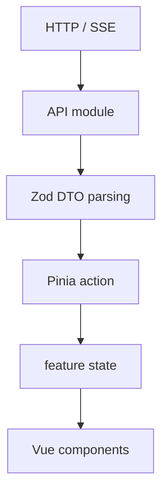

# The web UI

The current web interface is a Vue 3 single-page application served by the Nox
runtime. It presents runtime state through HTTP DTOs and Server-Sent Events
(SSE); it does not share kernel objects directly.

This page separates current implementation from future direction. Source lives
under [`src/ui/`](../src/ui/), and the import boundary is checked in
[`src/boundaries.test.ts`](../src/boundaries.test.ts).

---

## Current stack

| Area | Current choice |
|---|---|
| Framework | Vue 3 Single File Components |
| Language | TypeScript |
| Build | Vite, run with Bun |
| State | Pinia |
| Routing | Vue Router |
| Styles | SCSS and CSS Custom Properties |
| Forms | VeeValidate and Zod |
| Markdown | `markdown-it`, `highlight.js`, and KaTeX |
| HTTP server | Elysia on Bun |
| Live updates | HTTP commands and SSE events |
| Tests | Vitest, Vue Testing Library, jsdom, and MSW |
| Static checks | TypeScript, ESLint, oxlint, and Prettier |

The UI is built as a client-only application because it is served by the local
runtime and does not currently need server-side rendering. This describes the
present implementation, not a permanent restriction on future work.

Not currently present: browser end-to-end tests, Stylelint, a component
workshop, or an accessible-primitives dependency.

---

## Layout

The UI lives in `src/ui/` as a workspace inside the repository:

```text
src/ui/
├── app/            application shell, router, bootstrap, app-wide stores
├── routes/         access, chat, sessions, memory, settings
├── features/       domain components, API modules, stores, model helpers
├── shared/         API infrastructure, i18n, styles, reusable UI primitives
└── public/         static files
```

Feature-specific code generally stays with its feature. Shared primitives are
introduced when more than one feature has a concrete use for them. The current
shared UI directory contains components such as `NoxButton`, `NoxPanel`,
`NoxNotice`, `NoxStatus`, and `NoxTextField`; larger domain components remain in
their feature directories.

The desired dependency direction is:

```text
route or feature → shared UI / API modules
UI DTOs          ← HTTP surface ← runtime
```

The boundary test checks that code outside `src/ui/` does not import UI modules
and that UI code does not import kernel source modules.

---

## State and data flow



Current API modules perform requests and parse response DTOs. Components use
stores and actions rather than issuing those requests independently.

### State ownership

| Owner | Current responsibility |
|---|---|
| **Vue Router** | Active route and URL-addressable settings sections |
| **Pinia** | Authentication state, chat projection, sessions, memory, settings catalogs |
| **Component state** | Form drafts, expansion, hover, and other local interaction state |

Asynchronous stores use explicit status values such as `loading`, `ready`, and
`failed`. The chat run state likewise uses named variants instead of unrelated
booleans.

### Chat history and events

The current chat store:

1. opens the SSE connection;
2. loads agent, command, and conversation catalogs;
3. reads up to 1,000 history entries for the selected conversation;
4. replays events buffered while the initial requests were in flight;
5. applies subsequent events through the store's event handler.

Messages and events carry IDs used for deduplication. If an SSE connection drops,
the client reconnects with the most recent event cursor in `Last-Event-ID`. This
behavior has coverage in
[`activeSession.store.vitest.ts`](../src/ui/features/chat/stores/activeSession.store.vitest.ts)
and the web broker tests.

The 1,000-entry history request is a current bound, not complete UI pagination.
A paginated or virtualized conversation window remains possible future work for
larger transcripts.

### Browser persistence

The current browser-persisted preference is the selected locale, stored under an
explicit key. Access tokens remain in the Pinia authentication store, while the
refresh token is sent in a backend-issued HttpOnly cookie.

Themes, density, panel state, and similar preferences may later use an explicit
allowlist. Credentials, transcripts, permission requests, and tool results are
not intended for browser persistence.

### Working guidelines

These are project preferences rather than inflexible rules:

1. Keep network calls in typed API modules.
2. Let stores own shared feature state and event projection.
3. Derive values instead of duplicating them when practical.
4. Keep persistence explicit and narrow.
5. Test state transitions without requiring the full application shell when
   that gives useful coverage.
6. Revisit an abstraction when a second concrete use appears.

---

## HTTP contract

JSON over HTTP handles commands. One authenticated SSE stream carries the events
rendered by the web broker.

```text
GET  /api/chat/agents
GET  /api/chat/commands
GET  /api/chat/conversations
GET  /api/chat/conversations/:conversationId/history
GET  /api/chat/stream
POST /api/chat/conversations/:conversationId/messages
POST /api/chat/conversations/:conversationId/steer
POST /api/chat/conversations/:conversationId/commands/:command
POST /api/chat/conversations/:conversationId/permissions/:requestId
```

Other current groups include `/api/auth`, `/api/config`, `/api/artifacts`,
`/api/sessions`, `/api/memories`, `/api/secrets`, `/api/extensions`,
`/api/capabilities`, `/api/i18n`, and `/api/health`.

The client generates `conversationId`. The runtime binds it to a session when the
first message arrives; there is no separate conversation-creation endpoint.

Each SSE event identifies its conversation and event type. The stream can carry
text fragments, settled messages, tool and reasoning activity, run lifecycle,
permission requests, titles, and context usage according to broker capability.

Context estimates are produced by the runtime and exposed to the browser. The UI
does not perform a separate token estimate.

The current transport is HTTP plus SSE. No WebSocket surface is implemented.

### UI/runtime boundary

```text
Runtime objects → HTTP routes → DTOs → UI API modules → Pinia
```

The UI does not import `Session`, `Agent`, or `SessionGate`. API modules define
schemas for the payloads they accept before those values reach stores.

---

## Styling and themes

SCSS currently holds component structure, responsive rules, and states. CSS
Custom Properties hold the active design tokens and make runtime theme changes
possible without rebuilding component styles.

The repository currently ships the `machine` theme. Reduced-motion media queries
are present in the shared motion tokens and several animated components. Broader
theme and accessibility matrices still need browser-level verification.

---

## Testing status

The UI suite currently uses:

- **Vitest and Vue Testing Library** for stores, components, route behavior, and
  interaction states;
- **MSW** for HTTP fixtures in UI tests;
- **jsdom** as the test environment.

Representative coverage includes authentication, SSE parsing and reconnection,
chat event projection, artifacts, settings schemas and catalogs, memory routes,
session/audit routes, and i18n. The test files are visible under
[`src/ui/`](../src/ui/).

Browser E2E flows such as claim, login, chat streaming, permission handling, and
configuration editing are not automated yet. Visual regression and tested theme
coverage are also pending, so this documentation does not claim them.

---

## Authentication

A fresh container presents a claim form that requires the ephemeral code written
to its logs. After registration, the access token is held in memory and renewal
uses the HttpOnly refresh cookie.

See [configuration.md](configuration.md) for `auth.accessTtlSeconds`,
`auth.refreshTtlSeconds`, and `auth.secureCookies`.

---

## Internationalization

The browser starts with message keys and obtains language catalogs from the
runtime through `/api/i18n`. That route is public because the access screen needs
localized text before authentication.

Extensions can contribute translation fragments for UI copy they own. See
[extensions/README.md](extensions/README.md#languages-and-extension-owned-ui-copy).
